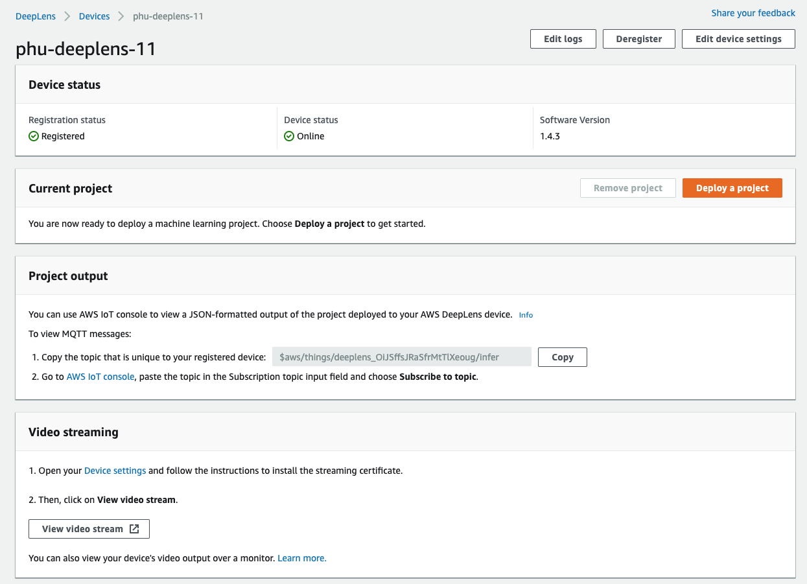
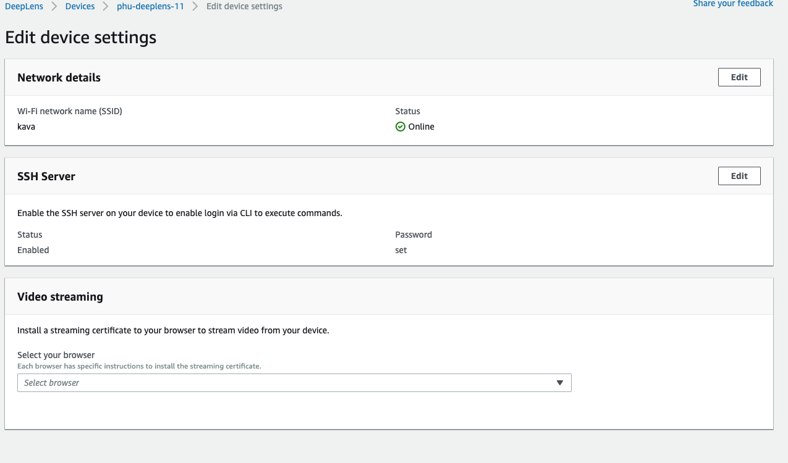
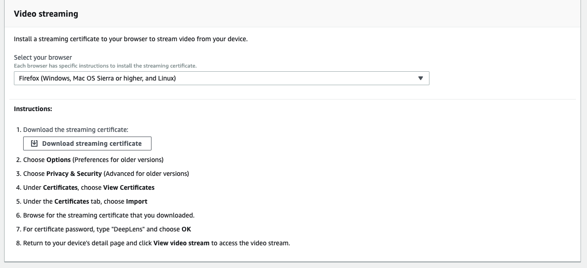
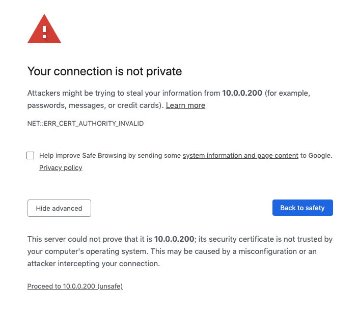
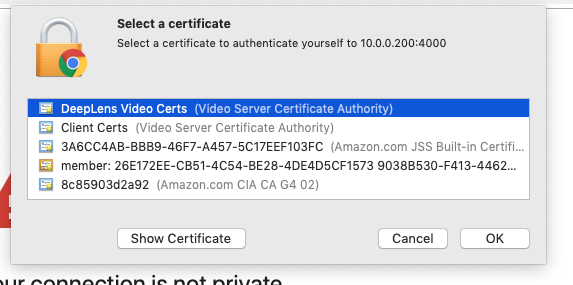

# View video stream

## Option 1: View video stream from your laptop's browser

### Step 1: Install the streaming certificate

From your AWS DeepLens console, go to **Devices** and click on your device name. You should see a page like the one below.

Now connect your device via USB cable and select **Device Settings** under *Video Streaming*.

Device Settings

Under *video streaming*, select your browser and OS. Follow the *instructions* provide to install the streaming certificate. 

*Hint*: for newer macOS and Windows, you can double click on the downloaded certificate to install it. You will need administrative access to your computer to install the certificate.

### Step 2: View the video stream

Go back to your device page and click **View video stream**.

You will be taken to a page like this. Do not be alarmed. 

Click on **Advanced** and **Proceed to x.x.x.x (unsafe)**. Trust us, it's safe.

For macOS you'll need to select the streaming certificate you installed earlier.

It will take a couple of seconds for the stream to load, please be patient.