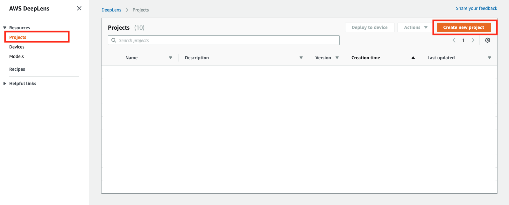
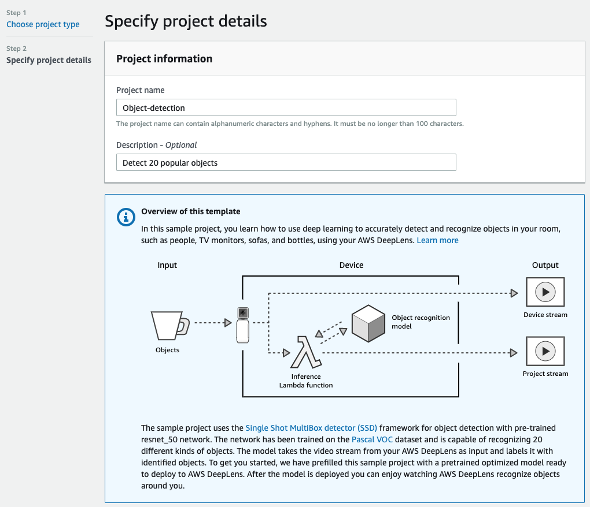
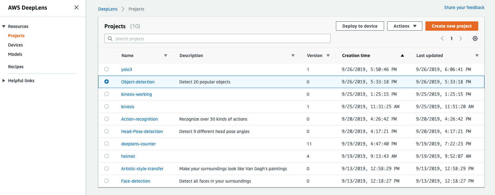
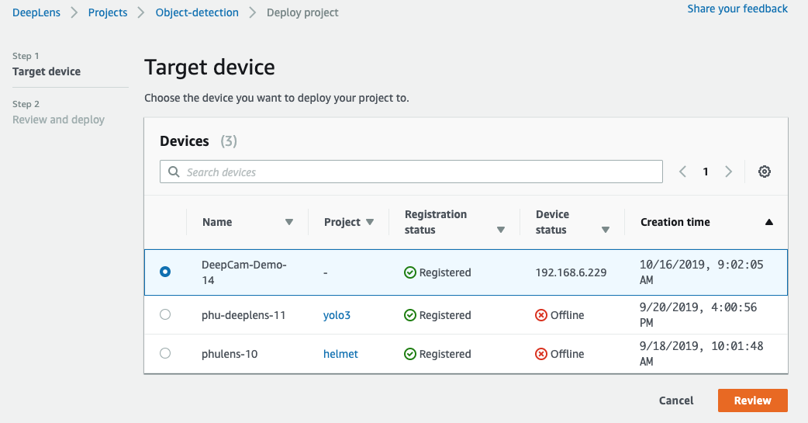
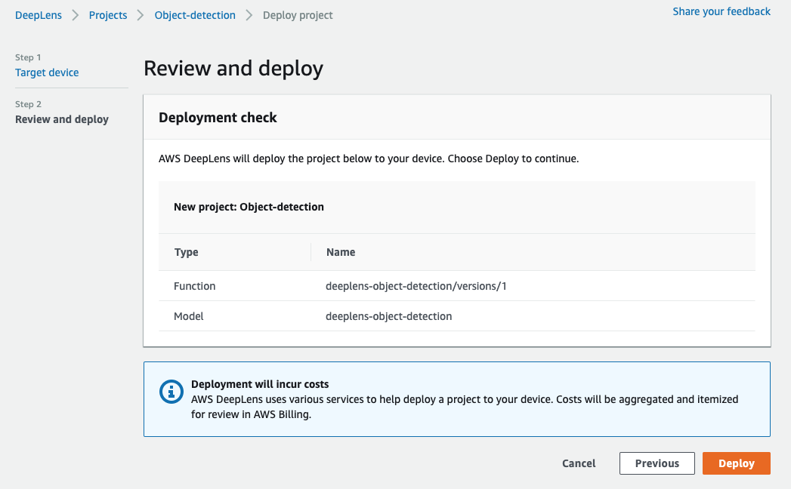
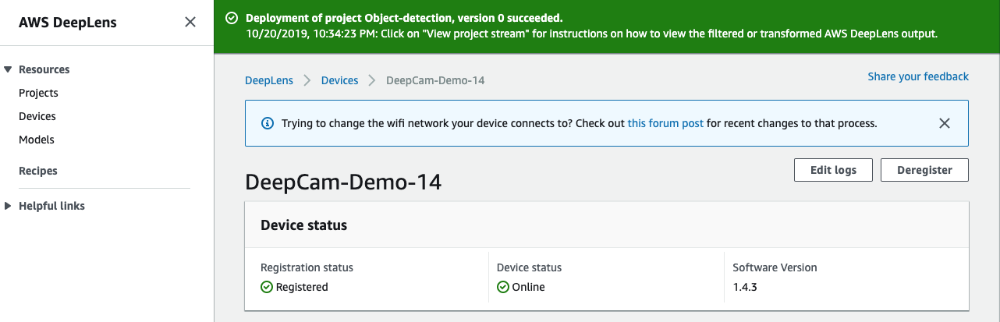
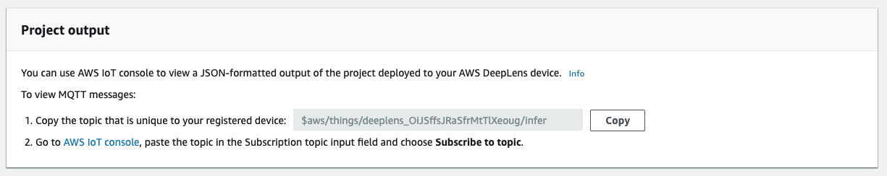
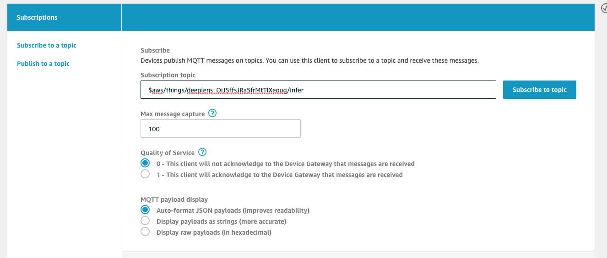
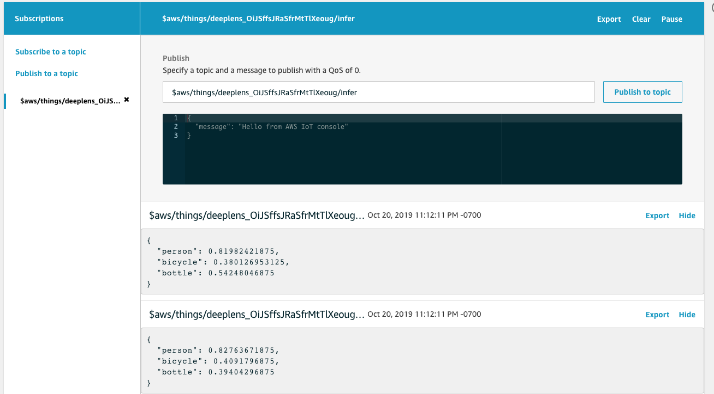

# Deploy a sample project

In this tutorial you'll learn how to deploy one of many available sample projects to your AWS DeepLens. Sample projects are ready-to-go model and code that lets you see what AWS DeepLens can do in 10 mins or less.

## 1. Create a new project

For *Project Type* select **Use a project template**

Then choose the **Object Detection** project template. Scroll down and click **Next**.

You are able to enter a project name and description. Scroll down and click **Create**.

## 2. Deploy to device

In this step, you will deploy the Face detection project to your AWS DeepLens device.

Select the project you just created from the list by choosing the radio button

Select Deploy to device.

On the Target device screen, choose your device from the list, and click **Review.**

Then click **Deploy**

You should be taken to your device's page and see the banner "Deploy Successful"

## 3. View Video Output

There are a few ways to view video output from your device, if you have a monitor and keyboard plugged in, you can open a Terminal (Ctrl+Alt+T) and enter the following command:

`mplayer -demuxer lavf -lavfdopts format=mjpeg:probesize=32 /tmp/results.mjpeg`

See the [documentation](https://docs.aws.amazon.com/deeplens/latest/dg/deeplens-viewing-output.html) for other ways you can view the project stream.

## 4. View IoT Output

Now let's see how AWS DeepLens communicates its inference results back to the AWS cloud.

We'll see the inference results inside the AWS IoT console. From here, you can make a lambda function that acts on the inference results.

Inside your device page, click **copy** to copy the IoT topic.

Then click **AWS IoT console** to view the output.

Paste in the IoT topic and click **Subscribe**.

You should see results like below:

