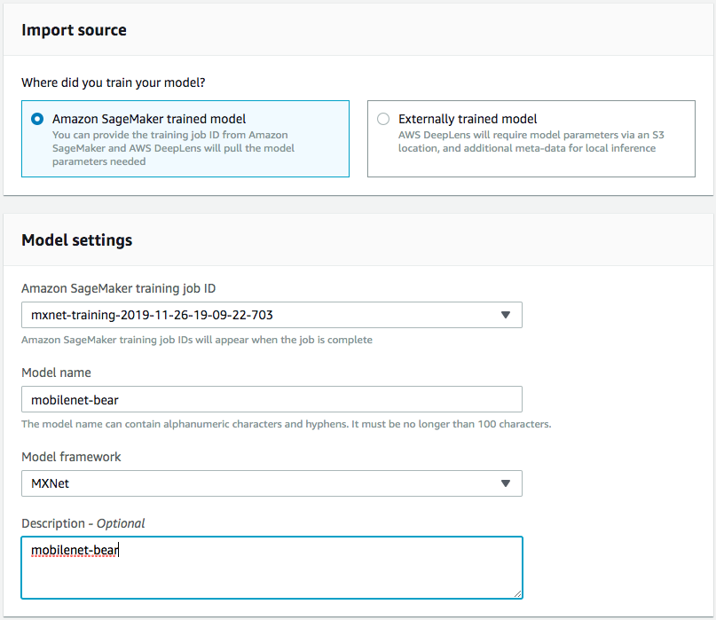
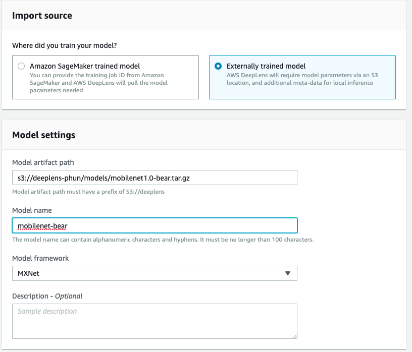
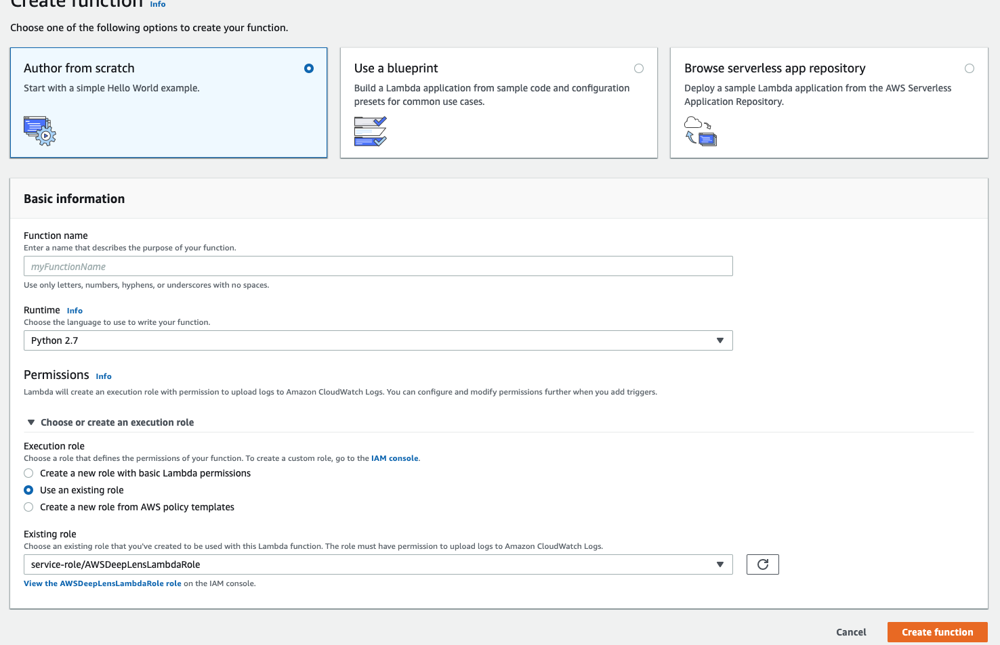
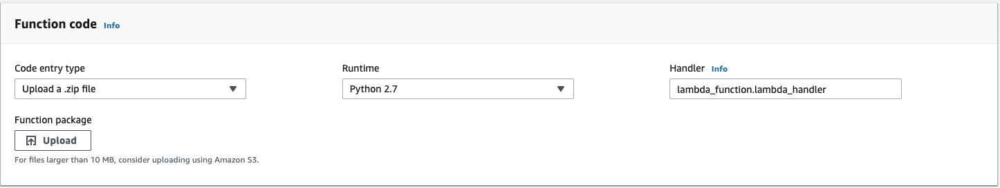
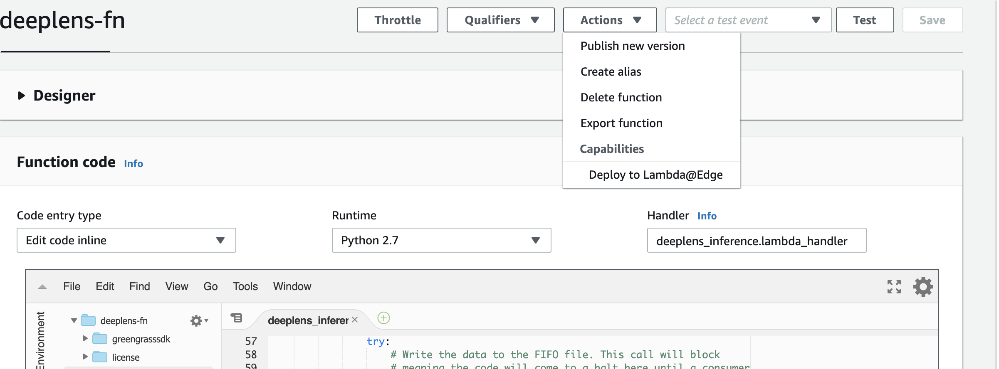
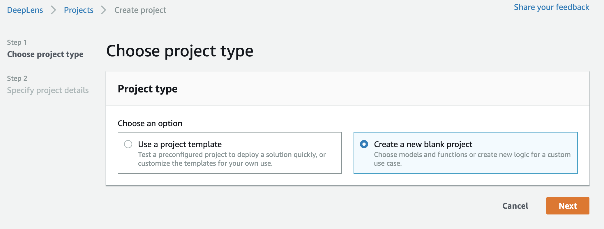
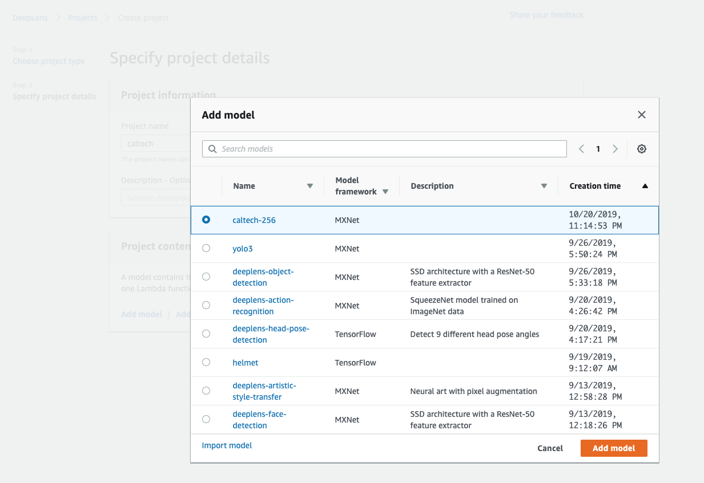
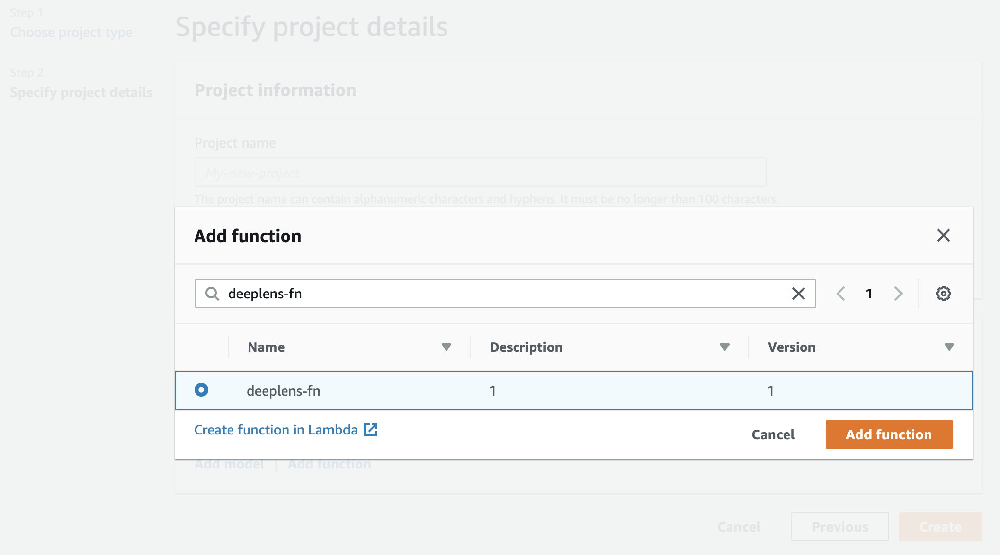

# Deploy a custom model

In this tutorial you'll learn how to deploy your own custom model trained using Amazon Sagemaker.

## Prereqs

1. You should have a model.tar.gz file output from training in Amazon SageMaker. If you missed the tutorial on training with Amazon Sagemaker, check out this tutorial.

**Note**: It's a important that your model lives inside an Amazon S3 bucket starting with "deeplens". Before you start training in Amazon SageMaker, make sure your project output in SageMaker goes to a bucket whose name starts with "deeplens".

Why?

The default security policies for AWS DeepLens restricts DeepLens access to only Amazon S3 buckets that start with "deeplens". You can modify this policy *AWSDeepLensServiceRolePolicy*, but for the purposes of this tutorial it is easier to create a new S3 bucket with the appropriate naming.

2. Download the [**deeplens-lambda.zip**](src/deeplens-lambda.zip) onto your computer.


## 1. Import your model into AWS DeepLens

In your AWS DeepLens console, go to **Models** and click on **Import model**


### (Option 1) Select **Amazon SageMaker trained model**. 

Select the SageMaker training job for the model.

Enter any model name.

Then select **MXNet** as your model framework.




### (Option 2) Select **Externally trained model**. 

Enter the path of your model in S3.

Enter any model name.

Then select **MXNet** as your model framework.




Then click **Import model**.

## 2. Create the AWS Lambda function to be deployed to AWS DeepLens

DeepLens makes it easy to deploy custom code to process the image through a AWS Lambda function that lives on DeepLens. You'll create your Lambda function in the AWS cloud console.

Go to AWS Lambda in your AWS console and click **Create Function**.

Then select **Author from Scratch** and make sure the follow options are selected:

Runtime: **Python 2.7**

Choose or create an execution role: **Use an existing role**

Existing role: **service-role/AWSDeepLensLambdaRole**



Once the function is created, scroll down on the function's detail page and choose **Upload zip** in *Code entry type*



Upload the **deeplens-lambda.zip**.

Let's walk through this code to make sure we understand what's going on:

First we have a helper class for local display of the inference results. This helper class will help us stream the processed video frames to a local display or to your laptop via the web browser.

```python
class LocalDisplay(Thread):
    """ Class for facilitating the local display of inference results
        (as images). The class is designed to run on its own thread. In
        particular the class dumps the inference results into a FIFO
        located in the tmp directory (which lambda has access to). The
        results can be rendered using mplayer by typing:
        mplayer -demuxer lavf -lavfdopts format=mjpeg:probesize=32 /tmp/results.mjpeg
    """
    def __init__(self, resolution):
        """ resolution - Desired resolution of the project stream """
        # Initialize the base class, so that the object can run on its own
        # thread.
        super(LocalDisplay, self).__init__()
        # List of valid resolutions
        RESOLUTION = {'1080p' : (1920, 1080), '720p' : (1280, 720), '480p' : (858, 480)}
        if resolution not in RESOLUTION:
            raise Exception("Invalid resolution")
        self.resolution = RESOLUTION[resolution]
        # Initialize the default image to be a white canvas. Clients
        # will update the image when ready.
        self.frame = cv2.imencode('.jpg', 255*np.ones([640, 480, 3]))[1]
        self.stop_request = Event()

    def run(self):
        """ Overridden method that continually dumps images to the desired
            FIFO file.
        """
        # Path to the FIFO file. The lambda only has permissions to the tmp
        # directory. Pointing to a FIFO file in another directory
        # will cause the lambda to crash.
        result_path = '/tmp/results.mjpeg'
        # Create the FIFO file if it doesn't exist.
        if not os.path.exists(result_path):
            os.mkfifo(result_path)
        # This call will block until a consumer is available
        with open(result_path, 'w') as fifo_file:
            while not self.stop_request.isSet():
                try:
                    # Write the data to the FIFO file. This call will block
                    # meaning the code will come to a halt here until a consumer
                    # is available.
                    fifo_file.write(self.frame.tobytes())
                except IOError:
                    continue

    def set_frame_data(self, frame):
        """ Method updates the image data. This currently encodes the
            numpy array to jpg but can be modified to support other encodings.
            frame - Numpy array containing the image data of the next frame
                    in the project stream.
        """
        ret, jpeg = cv2.imencode('.jpg', cv2.resize(frame, self.resolution))
        if not ret:
            raise Exception('Failed to set frame data')
        self.frame = jpeg

    def join(self):
        self.stop_request.set()
```

Next we have the Python code that initializes looping through the inference logic, frame by frame.

```python
def infinite_infer_run():
    """ Run the DeepLens inference loop frame by frame"""
    # Create an IoT client for sending to messages to the cloud.
    client = greengrasssdk.client('iot-data')
    iot_topic = '$aws/things/{}/infer'.format(os.environ['AWS_IOT_THING_NAME'])

    try:     
        # Number of top classes to output
        num_top_k = 3

        # The height and width of the training set images
        input_height = 224
        input_width = 224
        
        model_type = 'classification'
        model_name = 'mobilenet1.0-bear'
        
        with open('labels.txt', 'r') as f:
	        output_map = [l.rstrip() for l in f]

        # Create a local display instance that will dump the image bytes to a FIFO
        # file that the image can be rendered locally.
        local_display = LocalDisplay('480p')
        local_display.start()
				# The aux_inputs is equal to the number of epochs and in this case, it is 10
        error, model_path = mo.optimize(model_name,input_width,input_height, aux_inputs={'--epoch': 10})
        
        
        # Load the model onto the GPU.
        client.publish(topic=iot_topic, payload='Loading model')
        model = awscam.Model(model_path, {'GPU': 1})
        client.publish(topic=iot_topic, payload='Model loaded')

        
        # Do inference until the lambda is killed.
        while True:
            # Inference loop placeholder (see below)


    except Exception as ex:
    	print('Error in lambda {}'.format(ex))
      client.publish(topic=iot_topic, payload='Error in lambda: {}'.format(ex))

```

The inference initialization proceeds as follows:

1. Specifies the model type (`model_type`), model artifact path (`model_path`) to load the model artifact ([awscam.Model](https://docs.aws.amazon.com/deeplens/latest/dg/deeplens-device-library-awscam-model-constructor.html)), specifying whether the model is loaded into the device's GPU (`{'GPU':1}`) or CPU (`{'CPU':0}`). We don't recommend using the CPU because it is much less efficient. The model artifacts are deployed to the device in the `/opt/awscam/artifacts` directory. For the artifact optimized for DeepLens, it consists of an `.xml` file located in this directory. For the artifact not yet optimized for DeepLens, it consists of a JSON file and a another file with the `.params` extension located in the same directory. For optimized model artifact file path, set the `model_path` variable to a string literal:

   ```
   model_path = "/opt/awscam/artifacts/<model-name>.xml"
   ```

   In this example, `*``*` is `image-classification`.

   For unoptimized model artifacts, use the [mo.optimize](https://docs.aws.amazon.com/deeplens/latest/dg/deeplens-model-optimizer-api-functions_and_objects.html) function to optimized the artifacts and to obtain the `model_path` value of a given model name (`*``*`):

   ```
   error, model_path = mo.optimize(<model_name>, input_width, input_height)
   ```

   Here, the `model_name` value should be the one you specified when [importing the model](https://docs.aws.amazon.com/deeplens/latest/dg/deeplens-import-external-trained.html). You can also determine the model name by inspecting the S3 bucket for the model artifacts or the local directory of `/opt/awscam/artifacts` on your device. For example, unoptimized model artifacts output by MXNet consists of a `*``*-symbol.json` file and a `*``*-0000`.params file. If a model artifact consists of the following two files: `hotdog_or_not_model-symbol.json` and `hotdog_or_not_model-0000.params`, you specify `hotdog_or_not_model` as the input `*``*` value when calling `mo.optimize`.

2. Specifies `input_width` and `input_height` as the width and height in pixels of images used in training. To ensure meaningful inference, you must convert input image for inference to the same size.

3. Specifies as part of initialization the model type ([model_type](https://docs.aws.amazon.com/deeplens/latest/dg/deeplens-device-library-awscam-model-parseresult.html)) and declares the output map (`output_map`). In this example, the model type is `classification`. Other model types are `ssd` (single shot detector) and `segmentation`. The output map will be used to map an inference result label from a numerical value to a human readable text. For binary classifications, there are only two labels (`0` and `1`).

   The `num_top_k `variable refers to the number of inference result of the highest probability. The value can range from 1 to the maximum number of classifiers. For binary classification, it can be `1` or `2`.

4. Instantiates an AWS IoT Greengrass SDK (`greengrasssdk`) to make the inference output available to the AWS Cloud, including sending process info and processed result to an AWS IoT topic (`iot_topic`) that provides another means to view your AWS DeepLens project output, although as JSON data, instead of a video stream.

5. Starts a thread (`local_display.start`) to feed parsed video frames for local display (`LocalDisplay`), [on device](https://docs.aws.amazon.com/deeplens/latest/dg/deeplens-viewing-device-output-on-device.html#deeplens-viewing-output-project-stream) or [using a web browser](https://docs.aws.amazon.com/deeplens/latest/dg/deeplens-viewing-device-output-in-browser.html).

Inside the while loop we have the inference code:

```python
						# Get a frame from the video stream
            ret, frame = awscam.getLastFrame()
            if not ret:
                raise Exception('Failed to get frame from the stream')
            # Resize frame to the same size as the training set.
            frame_resize = cv2.resize(frame, (input_height, input_width))
	    frame_resize = frame_resize.astype('float32') / 255.0
            # Run the images through the inference engine and parse the results using
            # the parser API, note it is possible to get the output of doInference
            # and do the parsing manually, but since it is a classification model,
            # a simple API is provided.
            parsed_inference_results = model.parseResult(model_type,
                                                         model.doInference(frame_resize))
            # Get top k results with highest probabilities
            top_k = parsed_inference_results[model_type][0:num_top_k]
            # Add the label of the top result to the frame used by local display.
            # See https://docs.opencv.org/3.4.1/d6/d6e/group__imgproc__draw.html
            # for more information about the cv2.putText method.
            # Method signature: image, text, origin, font face, font scale, color, and thickness
            output_text = '{} : {:.2f}'.format(output_map[top_k[0]['label']], top_k[0]['prob'])
            cv2.putText(frame, output_text, (10, 70), cv2.FONT_HERSHEY_SIMPLEX, 3, (255, 165, 20), 8)
            
            # Set the next frame in the local display stream.
            local_display.set_frame_data(frame)
            # Send the top k results to the IoT console via MQTT
            cloud_output = {}
            for obj in top_k:
                cloud_output[output_map[obj['label']]] = obj['prob']
            client.publish(topic=iot_topic, payload=json.dumps(cloud_output))
```


The frame-by-frame inference logic flows as follows:

1. Captures a frame from the DeepLens device video feed ([awscam.getLastFrame()](https://docs.aws.amazon.com/deeplens/latest/dg/deeplens-device-library-awscam-model-get-last-frame.html)).
2. Processes the captured input frame (`cv2.resize(frame, (input_height, input_width))`) to ensure that its dimensions match the dimensions of the frame that the model was trained on. Depending on the model training, you might need to perform other preprocessing steps, such as image normalization.
3. Performs inference on the frame based on the specified model: `result = model.doInference(frame_resize)`.
4. Parses the inference result: `model.parseResult(model_type, result)`.
5. Sends the frame to the local display stream: `local_display.set_frame_data`. If you want to show the human-readable label of the most likely category in the local display, add the label to the captured frame: `cv2.putText`. If not, ignore the last step.
6. Sends the inferred result to IoT: `client.publish`.

Your complete lambda function should look like below:

```python
#*****************************************************
#                                                    *
# Copyright 2018 Amazon.com, Inc. or its affiliates. *
# All Rights Reserved.                               *
#                                                    *
#*****************************************************
from threading import Thread
from threading import Event
from threading import Timer
import os
import json
import time
import numpy as np
import awscam
import cv2
import mo
import greengrasssdk

def lambda_handler(event, context):
    """Empty entry point to the Lambda function invoked from the edge."""
    return

class LocalDisplay(Thread):
    """ Class for facilitating the local display of inference results
        (as images). The class is designed to run on its own thread. In
        particular the class dumps the inference results into a FIFO
        located in the tmp directory (which lambda has access to). The
        results can be rendered using mplayer by typing:
        mplayer -demuxer lavf -lavfdopts format=mjpeg:probesize=32 /tmp/results.mjpeg
    """
    def __init__(self, resolution):
        """ resolution - Desired resolution of the project stream """
        # Initialize the base class, so that the object can run on its own
        # thread.
        super(LocalDisplay, self).__init__()
        # List of valid resolutions
        RESOLUTION = {'1080p' : (1920, 1080), '720p' : (1280, 720), '480p' : (858, 480)}
        if resolution not in RESOLUTION:
            raise Exception("Invalid resolution")
        self.resolution = RESOLUTION[resolution]
        # Initialize the default image to be a white canvas. Clients
        # will update the image when ready.
        self.frame = cv2.imencode('.jpg', 255*np.ones([640, 480, 3]))[1]
        self.stop_request = Event()

    def run(self):
        """ Overridden method that continually dumps images to the desired
            FIFO file.
        """
        # Path to the FIFO file. The lambda only has permissions to the tmp
        # directory. Pointing to a FIFO file in another directory
        # will cause the lambda to crash.
        result_path = '/tmp/results.mjpeg'
        # Create the FIFO file if it doesn't exist.
        if not os.path.exists(result_path):
            os.mkfifo(result_path)
        # This call will block until a consumer is available
        with open(result_path, 'w') as fifo_file:
            while not self.stop_request.isSet():
                try:
                    # Write the data to the FIFO file. This call will block
                    # meaning the code will come to a halt here until a consumer
                    # is available.
                    fifo_file.write(self.frame.tobytes())
                except IOError:
                    continue

    def set_frame_data(self, frame):
        """ Method updates the image data. This currently encodes the
            numpy array to jpg but can be modified to support other encodings.
            frame - Numpy array containing the image data of the next frame
                    in the project stream.
        """
        ret, jpeg = cv2.imencode('.jpg', cv2.resize(frame, self.resolution))
        if not ret:
            raise Exception('Failed to set frame data')
        self.frame = jpeg

    def join(self):
        self.stop_request.set()

def infinite_infer_run():
    """ Run the DeepLens inference loop frame by frame"""
    # Create an IoT client for sending to messages to the cloud.
    client = greengrasssdk.client('iot-data')
    iot_topic = '$aws/things/{}/infer'.format(os.environ['AWS_IOT_THING_NAME'])
    try:
        # Number of top classes to output
        num_top_k = 3

        # The height and width of the training set images
        input_height = 224
        input_width = 224
        
        model_type = 'classification'
        model_name = 'mobilenet1.0-bear'
        
        with open('labels.txt', 'r') as f:
	        output_map = [l.rstrip() for l in f]

        # Create a local display instance that will dump the image bytes to a FIFO
        # file that the image can be rendered locally.
        local_display = LocalDisplay('480p')
        local_display.start()

        # The aux_inputs is equal to the number of epochs and in this case, it is 10
        error, model_path = mo.optimize(model_name,input_width,input_height, aux_inputs={'--epoch': 10})
        
        # Load the model onto the GPU.
        client.publish(topic=iot_topic, payload='Loading model')
        model = awscam.Model(model_path, {'GPU': 1})
        client.publish(topic=iot_topic, payload='Model loaded')
        
        while True:
            # Get a frame from the video stream
            ret, frame = awscam.getLastFrame()
            if not ret:
                raise Exception('Failed to get frame from the stream')
            # Resize frame to the same size as the training set.
            frame_resize = cv2.resize(frame, (input_height, input_width))
            # Run the images through the inference engine and parse the results using
            # the parser API, note it is possible to get the output of doInference
            # and do the parsing manually, but since it is a classification model,
            # a simple API is provided.
            parsed_inference_results = model.parseResult(model_type,
                                                         model.doInference(frame_resize))
            # Get top k results with highest probabilities
            top_k = parsed_inference_results[model_type][0:num_top_k]
            # Add the label of the top result to the frame used by local display.
            # See https://docs.opencv.org/3.4.1/d6/d6e/group__imgproc__draw.html
            # for more information about the cv2.putText method.
            # Method signature: image, text, origin, font face, font scale, color, and thickness
            output_text = '{} : {:.2f}'.format(output_map[top_k[0]['label']], top_k[0]['prob'])
            cv2.putText(frame, output_text, (10, 70), cv2.FONT_HERSHEY_SIMPLEX, 3, (255, 165, 20), 8)
            # Set the next frame in the local display stream.
            local_display.set_frame_data(frame)
            # Send the top k results to the IoT console via MQTT
            cloud_output = {}
            for obj in top_k:
                cloud_output[output_map[obj['label']]] = obj['prob']
            client.publish(topic=iot_topic, payload=json.dumps(cloud_output))
    except Exception as ex:
      	print('Error in lambda {}'.format(ex))
        client.publish(topic=iot_topic, payload='Error in lambda: {}'.format(ex))

infinite_infer_run()
```

By default, the output classes are numbers 0-2. To see more meaningful labels, we have the  **labels.txt** file, a mapping between class number and label.

Choose **Save** to save the code you entered.

From the **Actions** dropdown menu list, choose **Publish new version**. Publishing the function makes it available in the AWS DeepLens console so that you can add it to your custom project.



Enter a version number and click publish!


## 3. Create a custom AWS DeepLens project

Inside the AWS DeepLens console, click on **Create Project**.

Then select **Create a blank project**.




Then click **Add model** and select your model.




Then click **Add function** and search for your AWS Lambda function by name.




Then click **Create** project.


## 4. Deploy the custom AWS DeepLens project

Deploying a custom project is the same as deploying the sample project. See this [tutorial](../../AIM229-Beginner/Lab1-Deploy-sample-project) on how.

## 5. View Video Output

There are a few ways to view video output from your device, if you have a monitor and keyboard plugged in, you can open a Terminal (Ctrl+Alt+T) and enter the following command:

`mplayer -demuxer lavf -lavfdopts format=mjpeg:probesize=32 /tmp/results.mjpeg`

See the [documentation](https://docs.aws.amazon.com/deeplens/latest/dg/deeplens-viewing-output.html) for other ways you can view the project stream.

